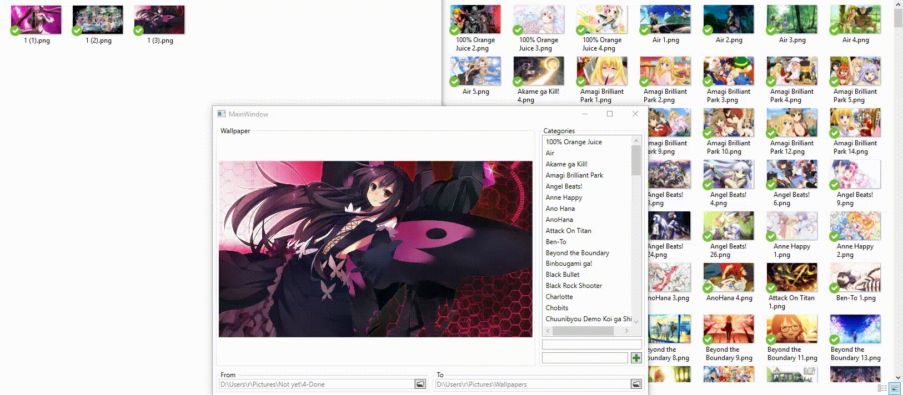
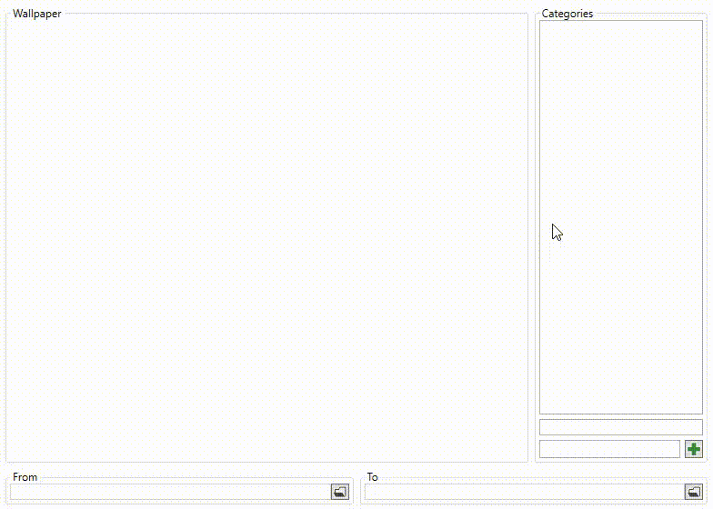
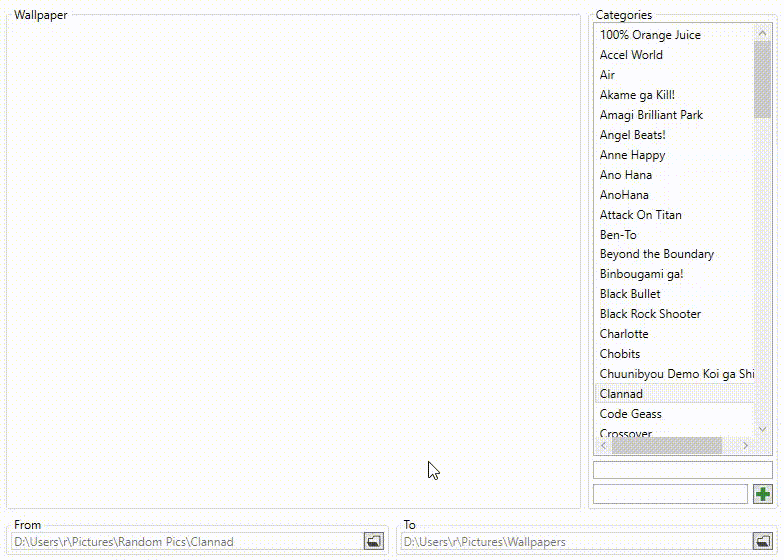

# AnimeWallpaperRenamer
Imagine you are a wallpaper collector who likes to find their wallpapers in batches, process them and then add them to your collection. Imagine that you also want to categories these wallpapers some way, so that you can easily keep track of what you have.

This is what this AnimeWallpaperRenamer was made for.

## How to use
The software requires you to select two folders; A "To" Folder and a "From" folder. Your "To" folder will contain your wallpaper collection and the "From" folder will contain the wallpapers you want to be categorized.

When a "To" folder has been selected, the software will scan through that folder and try to give you a list of what the software thinks are the categories that folder contains. So far, the categorization is simple. If an image matches the regex `"^(.*) [0-9]*$"`, then it is considered to be part of the category with the name that matched on the start of the regex (`(.*)`).

When a "From" folder has been selected a preview of the first wallpaper will be presented to you. Only when you double click on a category will the image be moved and the next presented.

